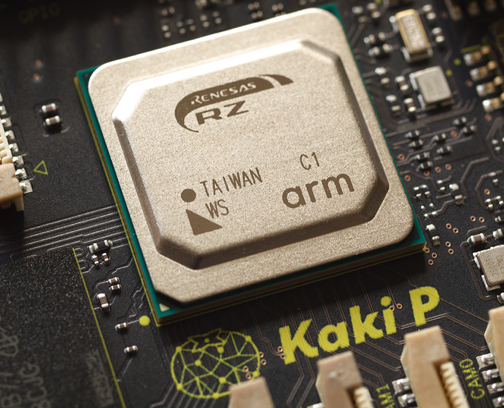

Kakip is based on the Renesas RZ/V2H processor. It features a quad-core Cortex-A55 CPU subsystem at 1.1GHz for system control, Cortex-R8 Dual subsystem for low-latency I/O and control, Coretx-M33, with 80TOPS AI Accelerator, DRP-AI3 and dynamically reconfigurable processor(DRP).

### Core Processor: Renesas "RZ/V2H"

In the development of next-generation robots, a sophisticated fusion of the brain and the physical is essential. The core processor “RZ/V2H” in Kakip has a multi-core configuration with three different CPUs that can simultaneously realize brain-side processing with Linux (AI image processing with DRP-AI3 and Open CV acceleration with DRP), physical control with RTOS, and I/O control. It provides an optimal solution on a single chip for various applications including robot development.

