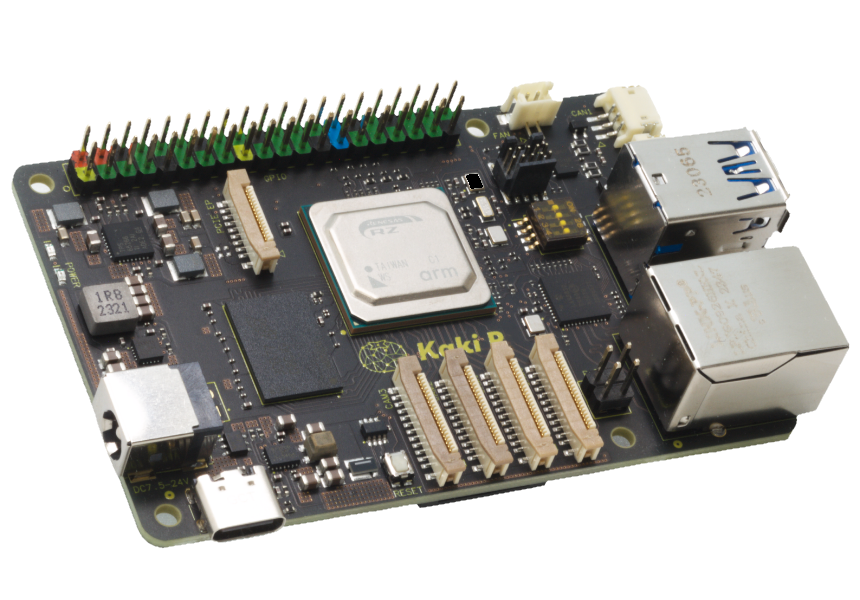
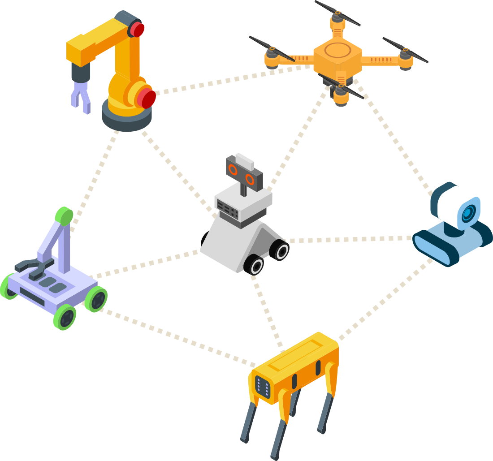

Kakip is a single board computer designed for edge AI applications.
Single Board Computer equiped with the new generation AI-MPU "Renesas RZ/VH2", has AI inference processing performance of up to 80TOPS with the powerful NPU "DRP-AI3" and multi-core CPU to run multiple OSs simultaneoucsly.
This small and powerful board is suitable for development and mebedded applications in robotics and other fields.

### Solutions offered by Kakip

"Kakip" is a Single Board Computer (SBC) that has both superior brainpower and physical control capabilities, with powerful AI image processing performance by "DRP-AI3" and multiple OSs control on multi-core processor. 
Despite its small size, Kakip is equipped with many interfaces, making it suitable for development and integration into a variety of applications, including robotics.

Can be used for manuy applications
* AMR (Autonomous Mobile Robot) / HSR (Human Support Robot)
* Vision sensor and factory IoT Equipment
* CCTV
* Drone
* Development of Rapid Prototype
* Education and Hobby

