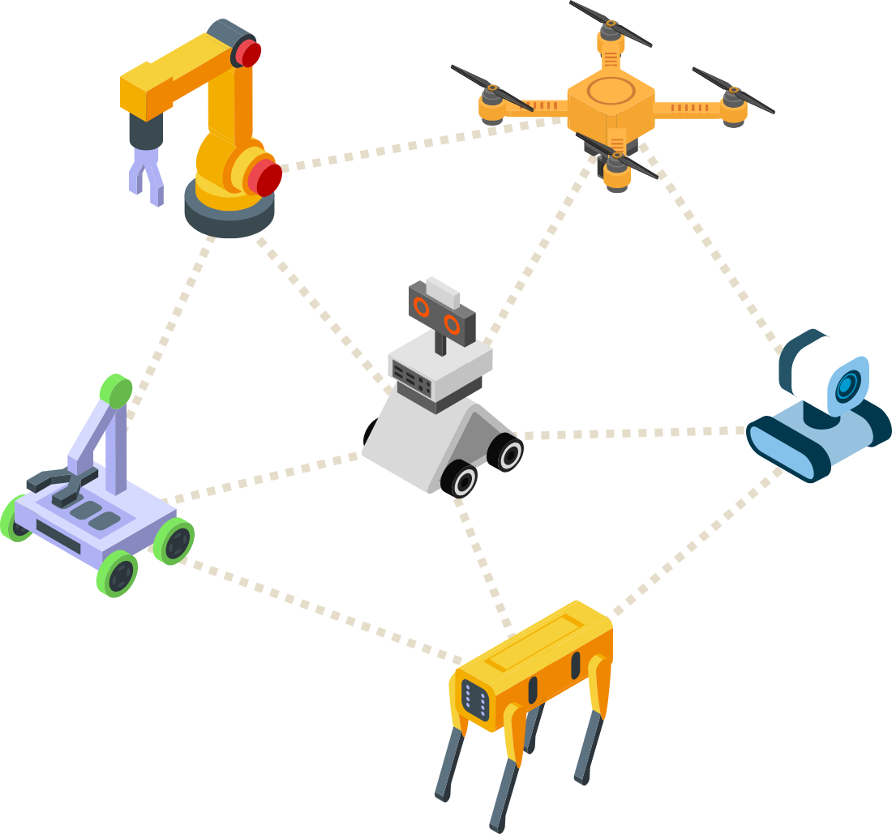

Kakipは強力なAI機能を実装したシングル・ボード・コンピューターです。
強力なNOU「DRP-AI3」を搭載し、最大80TOPSのAI推論祖寄りをワンボードで実行可能。
ROS2やRTOSなどの複数OSを同時実行できるマルチコアで小型ロボットに最適です。

### Kakipが提供するソリューション。

DRP-AI3による強力なAI画像処理性能とマルチコアによる複数OSの同時実行能力を持つKakipは、市場に出回る既存製品を凌駕する頭脳と制御能力を両方兼ね備えたSingle Board Computer (SBC)です。
小型でありながら多くのペリフェラルを備えているため、ロボティックスをはじめとする様々なアプリケーションの開発や組込みに最適です。

幅広いアプリケーションに最適
* AMRやHSR等の自律型ロボット
* IoT監視機器や工場のビジョンセンサ
* CCTVへの組込
* ドローン
* Rapid Prototype等の研究開発・学術研究
* タートルボット等のホビー用途

