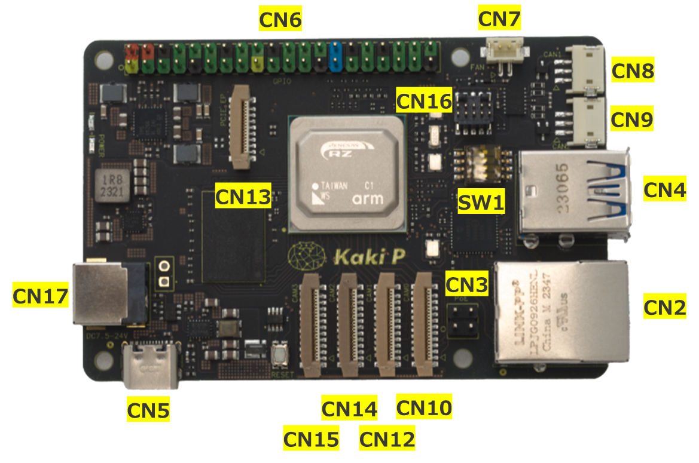
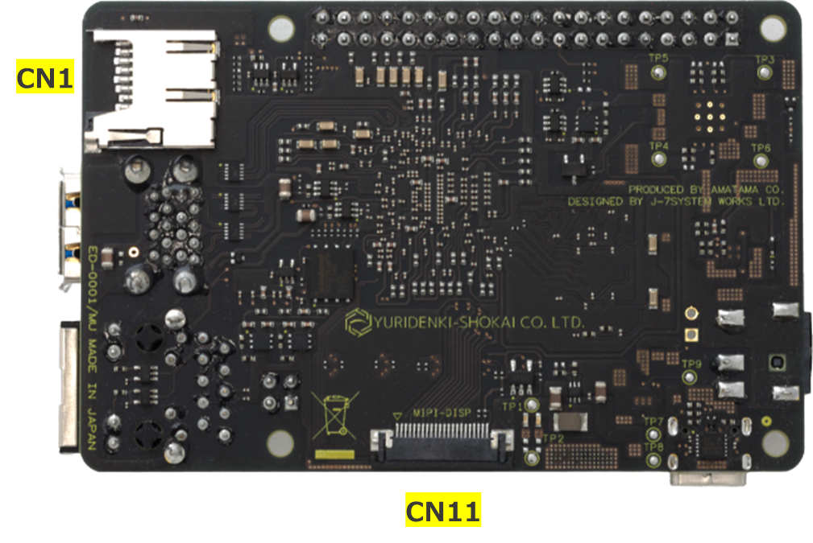

#### Connector

|CN|Name|Type|
|:---:|:---|:---|
|1|microSD|MEM2061-01-188-00-A|
|2|RJ45|LPJG0926HENL|
|3|PoE|TSW-102-07-G-D|
|4|USB Type-A|484060003|
|5|USB Type-C|USB4105-GF-A|
|6|GPIO|TSW-120-07-G-D|
|7|FAN|B2B-ZR-SM4-TF(LF)(SN)|
|8|CAN1|S3B-ZR-SM4A-TF(LF)(SN)|
|9|CAN2|S3B-ZR-SM4A-TF(LF)(SN)|
|10|MIPI CAM0|52559-2253|
|11|MIPI DSI|SFV22R-1STE1HLF|
|12|MIPI CAM1|52559-2253|
|13|PCIE|52559-1653|
|14|MIPI CAM2|52559-2253|
|15|MIPI CAM3|52559-2253|
|16|JTAG|BD125-10-A-0305-0580-L-B|
|17|DC|DC-044B-5A-2.0|
***
#### Switch

|SW|Name|Type|
|:---:|:---|:---|
|1|Mode|218-4LPSTR|

#### Operation setting on SW1
|DIP#|Name|Position| Description|
|:---|:---|:---:|:---|
|1|BOOTSEL|ON|boot from Cortex-A55|
|||OFF|boot from Cortex-A33|
|2 / 3|MD BOOT|ON / ON|prohibit|
|||OFF / ON|boot from SD card(only CA55)|
|||ON / OFF|boot from SCIF(CM33, CA55)|
|||OFF / OFF|boot from QSPI-Flash(CM33, CA55)|
|4|DEBUG EN|ON|JTAG debug mode|
|||OFF|normal mode|
