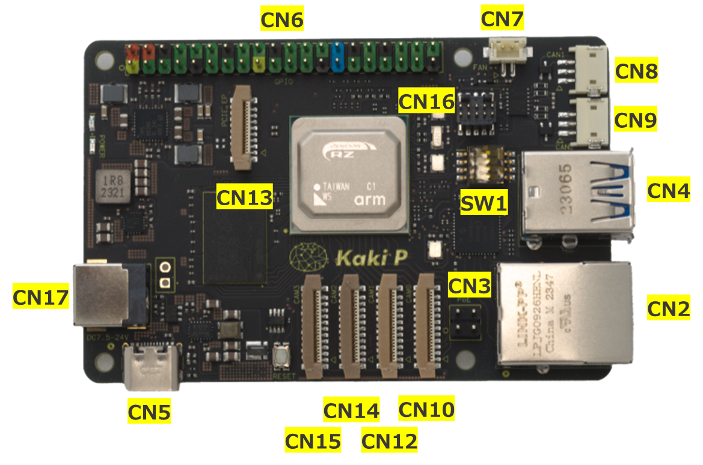
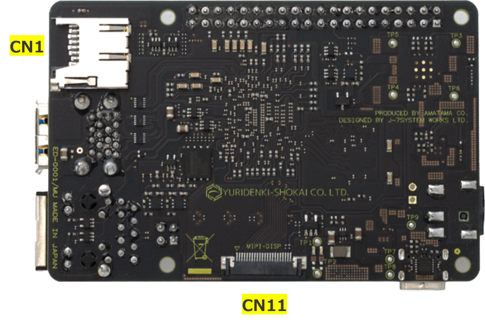

#### Connector

|CN|Name|Type|
|:---:|:---|:---|
|1|microSD|MEM2061-01-188-00-A|
|2|RJ45|LPJG0926HENL|
|3|PoE|TSW-102-07-G-D|
|4|USB Type-A|484060003|
|5|USB Type-C|USB4105-GF-A|
|6|GPIO|TSW-120-07-G-D|
|7|FAN|B2B-ZR-SM4-TF(LF)(SN)|
|8|CAN1|S3B-ZR-SM4A-TF(LF)(SN)|
|9|CAN2|S3B-ZR-SM4A-TF(LF)(SN)|
|10|MIPI CAM0|52559-2253|
|11|MIPI DSI|SFV22R-1STE1HLF|
|12|MIPI CAM1|52559-2253|
|13|PCIE|52559-1653|
|14|MIPI CAM2|52559-2253|
|15|MIPI CAM3|52559-2253|
|16|JTAG|BD125-10-A-0305-0580-L-B|
|17|DC|DC-044B-5A-2.0|
***
#### Switch

|SW|Name|Type|
|:---:|:---|:---|
|1|Mode|218-4LPSTR|

#### SW1の動作設定
|DIP#|Name|Position| Description|
|:---|:---|:---:|:---|
|1|BOOTSEL|ON|Cortex-A55からブート|
|||OFF|Cortex-A33からブート|
|2/3|MD BOOT|ON/ON|指定禁止|
|||OFF/ON|SDカードからブート(CA55のみ)|
|||ON/OFF|SCIFからブート(CM33, CA55)|
|||OFF/OFF|QSPI-Flashからブート(CM33, CA55)|
|4|DEBUG EN|ON|JTAGデバグモード|
|||OFF|ノーマルモード|